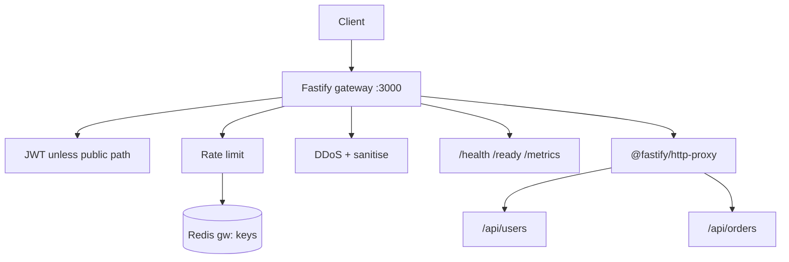

# Node TypeScript API Gateway

[](https://github.com/donny-devops/node-ts-api-gateway/actions)
[](LICENSE)

ESM API gateway that sits in front of HTTP services. It assigns a
transaction ID, enforces Helmet/CORS, applies Redis-backed (or in-process)
rate limiting, verifies JWT except on public paths, runs DDoS heuristics,
sanitises JSON/form/query input, reverse-proxies prefix-matched upstreams,
and emits Prometheus metrics plus structured transaction logs.

Local plugins still declare Fastify **4.x**. `package.json` currently
depends on Fastify **5.12.x** after Dependabot [#31](https://github.com/donny-devops/node-ts-api-gateway/pull/31); [#29](https://github.com/donny-devops/node-ts-api-gateway/pull/29) had pinned 4.x because those plugins will not load on 5.

There is **no Swagger UI**, **no circuit breaker**, and **no live
OpenTelemetry exporter** in this tree. `OTEL_*` exists in config only.

## Architecture

Plugin order in `src/server.ts` is the request pipeline:

```
Client
  → requestContext     transactionId, startTime, clientIp
  → Helmet / CORS / formbody
  → @fastify/rate-limit   Redis if connected, else in-process
  → @fastify/jwt
  → ddos               ban list, UA/Host checks, RPS flood
  → sanitise           XSS / SQL fingerprints / path traversal
  → auth               jwtVerify unless JWT_PUBLIC_PATHS
  → observability      Prometheus + transaction log
  → /health, /ready    or prefix proxy from UPSTREAMS
```



## Constraints

| Item | Actual behavior |
| --- | --- |
| Runtime | ESM (`"type": "module"`). Local plugins (`ddos`, `sanitise`, `observability`, `request-context`) pass `{ fastify: '4.x' }` to `fastify-plugin`. |
| Fastify | `package.json` is `fastify@^5.12.1` after [#31](https://github.com/donny-devops/node-ts-api-gateway/pull/31). [#29](https://github.com/donny-devops/node-ts-api-gateway/pull/29) pinned **4.29.x** so those plugins load. Treat a 4/5 mismatch as a known break until plugins are updated or Fastify is pinned back. |
| Node | CI uses **22.x**. The Dockerfile is **node:20-alpine**. Local Node 20+ is enough to run; match 22.x for CI-identical installs. |
| Install | `npm ci` — `package-lock.json` is required. |
| Listen | Default `HOST=0.0.0.0`, `PORT=3000`. `NODE_ENV=test` skips `listen()`. |
| Auth | Bearer JWT on every path except `JWT_PUBLIC_PATHS` (default `/health,/metrics,/ready`). |
| Redis | Optional. Connect failure logs a warning and continues; rate limit / bans become single-node. |
| Proxy | `UPSTREAMS` JSON array of `{ prefix, target }`. Compose defaults to `[]` (no proxy routes until you set it). |
| License | MIT. |

## Quickstart

```bash
git clone https://github.com/donny-devops/node-ts-api-gateway.git
cd node-ts-api-gateway
cp .env.example .env
npm ci
npm test          # vitest
npm run dev       # tsx watch src/server.ts
```

Probe (send a User-Agent — missing UA is rejected as 400):

```bash
curl -sS -A curl http://127.0.0.1:3000/health
# {"status":"ok","uptime":...}

curl -sS -A curl http://127.0.0.1:3000/ready
# {"status":"ready","checks":{"redis":"ok"}}   # or 503 if Redis was connected and ping failed
```

Protected routes need a token issued with the same `JWT_SECRET` and
`JWT_ISSUER`:

```bash
curl -sS -A curl -H "Authorization: Bearer $TOKEN" http://127.0.0.1:3000/api/users/me
```

## Scripts

| Script | Command |
| --- | --- |
| `npm run dev` | `tsx watch src/server.ts` |
| `npm run build` | `tsc` → `dist/src/server.js` (`rootDir` is `.` so `config/` compiles with `src/`) |
| `npm start` | `node dist/src/server.js` |
| `npm test` | `vitest run` |
| `npm run typecheck` | `tsc --noEmit` |
| `npm run lint` | `eslint src --max-warnings 0` |

## Configuration

All runtime knobs are in `config/gateway.ts` via `dotenv`. Copy
`.env.example` and change at least `JWT_SECRET` before any non-local use.

| Variable | Default | Role |
| --- | --- | --- |
| `PORT` / `HOST` | `3000` / `0.0.0.0` | Bind address |
| `TRUST_PROXY` | `false` | Honor `X-Forwarded-For` / `X-Real-IP` for rate limit and bans |
| `JWT_SECRET` | `change-me-to-a-long-random-secret` | HMAC secret for `@fastify/jwt` |
| `JWT_ISSUER` / `JWT_EXPIRES` | `api-gateway` / `1h` | Token `iss` and TTL |
| `JWT_PUBLIC_PATHS` | `/health,/metrics,/ready` | Exact path match, or prefix if the entry ends with `*` |
| `UPSTREAMS` | see `.env.example` | JSON array; each `prefix` is reverse-proxied to `target` |
| `RATE_LIMIT_GLOBAL_MAX` / `_WINDOW` | `500` / `60000` | `@fastify/rate-limit` window |
| `DDOS_RPS` / `DDOS_BURST` / `DDOS_BAN_MS` | `100` / `2.0` / `300000` | 1s RPS window; ban when count > RPS × burst |
| `SANITISE_XSS` / `SANITISE_SQL` / `SANITISE_PATH` | `true` | Body + query mutation |
| `REDIS_HOST` | `localhost` | Rate-limit store and IP ban list (`gw:` prefix) |
| `METRICS_ENABLED` / `METRICS_PATH` | `true` / `/metrics` | Prometheus text exposition |
| `ELK_ENABLED` | `false` | Extra pino-elasticsearch transport |
| `OTEL_ENABLED` | `false` | **Unused at runtime** — no SDK bootstrap in `src/` |

`RATE_LIMIT_AUTH_*` and `RATE_LIMIT_PER_ROUTE` are parsed in config but
are not applied to routes today. Counters `gateway_auth_failures_total`
and `gateway_rate_limit_hits_total` are registered but not incremented.

## Public HTTP surface

| Method | Path | Auth | Response |
| --- | --- | --- |
| `GET` | `/health` | public | `{ status: "ok", uptime }` — process liveness |
| `GET` | `/ready` | public | 200 `{ status: "ready", checks.redis }` or **503** `degraded` if a Redis client exists and `PING` fails. If Redis never connected, readiness still returns 200. |
| `GET` | `/metrics` | public | Prometheus text (`prom-client` registry) |
| `*` | `{prefix}/...` | JWT | Proxied to the matching `UPSTREAMS` target; prefix is preserved |

CORS allows `GET, POST, PUT, PATCH, DELETE, OPTIONS` and exposes
`X-Request-ID` plus rate-limit headers.

## Observability stack

`docker compose up -d` (after `cp .env.example .env`) starts:

| Service | URL |
| --- | --- |
| Gateway | `http://localhost:3000/health` |
| Grafana | `http://localhost:3001` (password `GRAFANA_PASSWORD`, default `admin`) |
| Prometheus | `http://localhost:9090` — scrapes `gateway:3000/metrics` |
| Kibana | `http://localhost:5601` |
| Elasticsearch | `http://localhost:9200` — transaction index `gateway-transactions` |

Compose sets `ELK_ENABLED=true` and `TRUST_PROXY=true`. Image healthcheck
in the Dockerfile uses **wget**; the compose `healthcheck` uses **curl**,
which is not installed in `node:20-alpine`.

Alert rules live in `observability/prometheus/rules/gateway-alerts.yml`.
Alertmanager is not wired (`targets: []`). The Prometheus config also
scrapes `redis-exporter:9121`, which this compose file does not run.

Transaction logs are ECS-shaped JSON on stdout (`src/services/transactionLogger.ts`).
When ELK is on they are also bulk-indexed via `pino-elasticsearch`.

## Docker

```bash
docker build -t node-ts-api-gateway .
docker run --rm -p 3000:3000 --env-file .env node-ts-api-gateway
```

Production image runs as UID 1001, `CMD ["node", "dist/src/server.js"]`.

## Layout

```
config/gateway.ts          env → typed config
src/server.ts              Fastify bootstrap + plugin order
src/plugins/               requestContext, observability
src/middleware/            auth, ddos, sanitise
src/routes/                health, proxy
src/services/              metrics, transactionLogger
src/types/                 FastifyRequest decorations
test/sanitise.test.ts      vitest unit tests (no live server)
observability/             Prometheus scrape + Grafana dashboard JSON
.github/workflows/         CI (Node 22, npm ci, build, test) + secret hygiene
```

## Troubleshooting

| Symptom | Cause / fix |
| --- | --- |
| `npm ci` fails on cache / lockfile | Commit `package-lock.json`. CI `setup-node` uses `cache: npm`. |
| `fastify-plugin` / `expected '4.x'` at boot | Local plugins declare Fastify 4. Pin `fastify` to `^4.29.1` (and matching `@fastify/*` 4-line plugins) **or** drop `fastify: '4.x'` after verifying Fastify 5 APIs. Do not leave #31's Fastify 5 bump against 4.x plugins. |
| Build output missing `config/` | `tsconfig.json` `rootDir` is `.` and `include` is `src` + `config`. Do not move config outside that include. |
| `400 Bad Request` / "security policy" on `/health` | DDoS middleware rejects missing `User-Agent` or missing `Host`, and UAs matching sqlmap/nikto/nmap/masscan/zgrab/`python-requests/0|1.`/`go-http-client/1.0`. |
| `401` on `/api/...` | Send `Authorization: Bearer`, signed with `JWT_SECRET` and `iss` = `JWT_ISSUER`. |
| Rate limits differ across replicas | Redis is down — counters are in-process. Check `[redis] failed to connect on start`. |
| `/ready` is 503 | Redis client is connected but `PING` failed. |
| Compose gateway has no `/api/*` routes | `UPSTREAMS` default in compose is `[]`. Set the JSON array in `.env`. |
| Compose reports unhealthy gateway | Alpine image has wget, not curl. Hit `/health` from the host instead. |
| No traces in an OTLP collector | `OTEL_ENABLED` is not read by `src/`. Metrics are Prometheus-only. |
| `NODE_ENV=test` and nothing listens | Intentional — `src/server.ts` skips `listen()` under test. |

## Security notes

- Change `JWT_SECRET` before exposing the process.
- Input sanitisation is heuristic (XSS library + regex). It is not a
  substitute for parameterized queries on upstreams.
- `/metrics` is public by default; scrape it on a private network or
  remove it from `JWT_PUBLIC_PATHS`.
- Report vulnerabilities privately — see [SECURITY.md](SECURITY.md).

## Contributing

See [CONTRIBUTING.md](CONTRIBUTING.md). Help and contact: [SUPPORT.md](SUPPORT.md).
